```{r, include=FALSE}
library(rgeos)
library(igraph)
library(rgdal)
library(rgl)
library(sp)
library(ggplot2)
library(knitr)

setwd("C:\\Users\\Usuario\\TELECO\\Master Tec Teleco\\2º CURSO\\Redes Sociales y Economicas\\Project\\GitHub\\RSE")
amsterdam <- read.csv("data\\amsterdam-wijk-2018-1-OnlyWeekdays-HourlyAggregate.csv", header = TRUE, sep = ",")
polys <- readOGR("data\\amsterdam_wijk.json")
```

\newpage

# Introduction (R)
Travelling from one place to another is a hard task in big cities. For that reason, some companies like Uber provide their users with cars, so they can easily travel in exchange of some money. Also, users can take the role of the drivers and get a payment. This service is specially important for tourists: they do not own a vehicle, and using the public transport may take a long time. There are many advantages and disadvantages about services of this kind, but it is not the main objective of this document to discuss them. 

Uber provides some datasets related with the use of their services in different cities around the world. It is possible to use that data in order to create a graph, where city areas are the nodes and their adjacencies are the edges. Next, we can analyze the traffic flow between different parts of a city. By doing that, it is the objective of this document to detect congested areas (meaning areas where the Uber traffic flow is very dense). Once that metric is calculated, it would be possible to use different criteria to find out the most congested area. That would mean that it is the area where most cars drive in and out, and so it is an important area. Moreover, some community detection algorithms can also be applied to this scenario. By performing this type of analysis, it is possible to identify groups of congested areas (or, in the same way, non congested areas). Note that there is one assumption made here: the Uber traffic is representative of the general traffic flow, meaning that if a particular area is traversed by many Uber cars, then it is likely that the same happens with ordinary traffic.

Those results could be used to identify which route can be followed to avoid dense traffic, or to identify important parts of the city (assuming that cars tend to drive in important areas).

Once different criteria are used for each kind of annalysis, some discussion will be made regarding how robust or accurate are the used method, together with some possible future improvements.

The code used during all the process can be found attached to this document.

# Dataset (R)

We can find a huge amount of information in the Uber website. Once there, we can get datasets which gather information on different big cities around the world, such as London, Paris, Amsterdam, Chicago, Los Angeles, New Dheli or Sydney. The only difference between datasets of different cities is the amount of data, because all of them are characterized by the same information. We chose to analyze the traffic flow in Amsterdam. Hence, every piece of information from this point on was analyzed for this city. 

There are two types of files in the datasets: geographical data (a GeoJSON file), and trips data (a CSV file).

GeoJSON is a format used for describing geographical data using JSON. It allows to define many different areas, shapes or others, using spatial objects (points, lines, polygons...) to do so. These objects are created from points, which are located by coordinates. In the case of the Uber dataset, GeoJSON is used to define areas of a city. An area is defined by a polygon, which can belong to one of the three cathegories below.

* **Simple polygon:** the area is enclosed into an ordinary polygon.

* **Simple polygon with holes:** the area is enclosed into a simple polygon, but there are parts inside that polygon which do not belong to the original area. In this case, The area is represented as an array of polygons. The first one defines the outer ring, while the rest of them define the holes.

* **Multipolygon:** the area is formed by different islands. In this case, it is represented by several polygons, each one of them corresponding to one island.

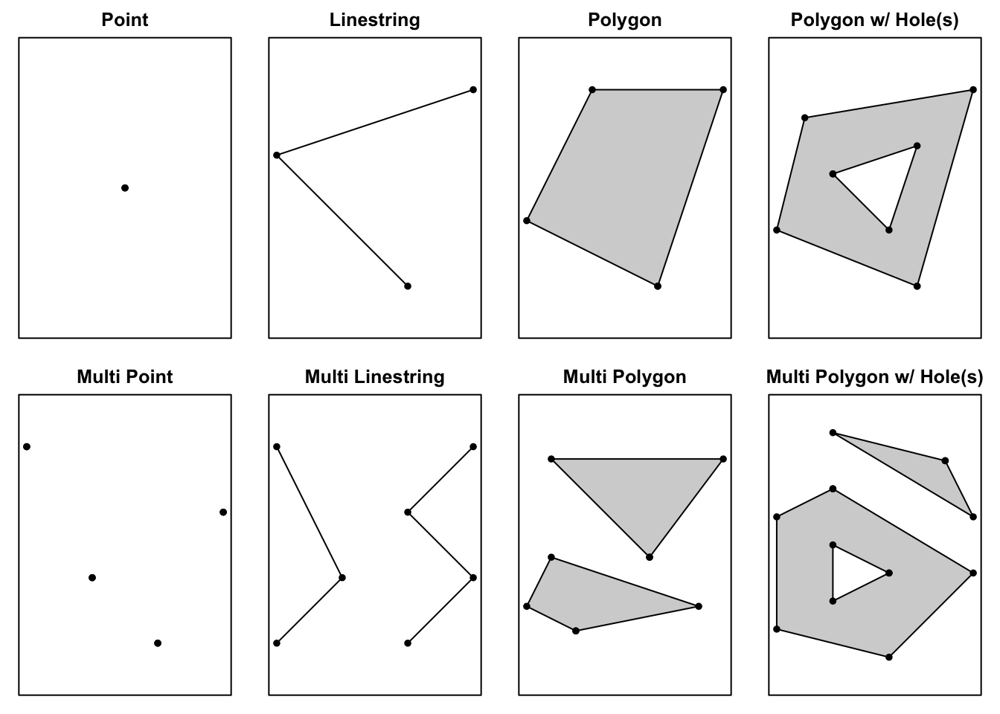{width=350px}

Each area is a polygon, and is identified by an ID. In the case of Amsterdam, there are `r length(polys)` of them, where the IDs are numbers from 0 to `r length(polys) - 1`. Since GeoJSON is a well kown format, there are different tools to read data from the previous file, such as the readOGR function. The geographical representation of the zones in Amsterdam can be found below. Recall that a zone can be formed by different polygons, or have holes. However, the vast majority of zones are defined by simple polygons, and those cases could barely be seen. Hence, all of them are shown using the same color in the figure below. 
```{r echo = FALSE}
plot(polys, main = "Zones in Amsterdam", col="#f44336",border="black", lwd=2)
```


The other type of file in the dataset is the Uber related one. It is a CSV file where each row corresponds to a single trip. A trip has an origin and a destination, it occured at a time and it has a duration, represented by several statisticals. An example of this kind of data can be found below. Note that the dataset only provides the origin and destination zone ID of the trip, and we do not know the route followed by the car. This will be a problem in the future.

```{r echo = FALSE}
kable(amsterdam[1:5,1:4], caption = "Uber data (columns 1 to 4)")
kable(amsterdam[1:5,5:7], caption = "Uber data (columns 5 to 7)")
```

We can slightly tune the information which is gathered in the CSV file, by the following parameters: only week days, only weekends or both; data hourly, weekly or monthly aggregated; data belonging to the first, second, third or forth quarter of a given year. The information analyzed in this document will be from the first quarter of 2018, hourly aggregated and from week days only. Hourly, because it is the most granulated option. Week days only, because we assume that those are the most busy days, and weekends could lower the average traffic flow in some areas. And first quarter of 2018, because it seemed updated enough. 

That means that we will know the time in which the annalyzed trips happened. Hence, we can treat sepparately trips at different times, obtaining the average evolution of the traffic during the day. 

# Graph (S)

The purpose of this project is to obtain a graph from the traffic flow dataset of Uber and perform different analyses on it. Specifically, centrality measures will be carried out to determine the areas where there is more traffic flow per time interval, at the same time that community detection algorithms are applied to know how the zones of the city can be grouped in clusters according to the traffic analyzed.

The first step is to build the graph from the dataset. The package used for creating and manipulating the graph is _igraph_. As mentioned in the previous section, the dataset is structured with a GeoJSON format. The idea is to create a graph from these data in which each node represents a predefined geographical area of the map and each edge represents a connection between adjacent zones. In addition, the graph is intended to be weighted and undirected. With a weighted graph we can represent how many trips have crossed each of the edges, increasing the weight by 1 for each time a user of Uber has crossed that area. On the other hand, the choice to create an undirected graph is due to the fact that each predefined zone can contain a set of roads, of which we do not know their direction (that is, the area is a black box), so we can not know if a particular road is congested only in one direction. Therefore, with an undirected graph, only the times a user traverses each road, either in one direction or in another, are represented.

To sum up the previous paragraph, we aim to create a weighted undirected graph. From _rgeos_ package the function _gTouches_ allows us to obtain the adjacency matrix from a GeoJSON object, i.e. a $n\times n$ matrix $A$ where

$$A_{ij}= \left\{ \begin{array}{lcc}
             true &   \text{if}  & \text{i and j are adjacent} \\
             false & & \text{otherwise}
             \end{array}
\right.$$.

Thus, this matrix defines which zones are adjacent to each other, so we can directly create a simple graph from it with the function _graph\_from\_adjacency\_matrix_, from _igraph_ package. This graph only contains the zones (nodes) and the connections (edges) among all of them.

Once you have the simple graph, the second step is to calculate the weights of each of the edges to represent the traffic that circulates from one area to another. As seen in the previous section, this information can not be taken out from the dataset directly, since only the source and destiny zones of each of the travels are provided. Hence, a priori, the route followed in each trip is unknown to us, so we must make an approximation on this path to be able to define complete routes.

The first approach was to use an API that provides the shortest route between two geographical points, such as Project OSRM (Open Source Routing Machine) or Google Maps Platform, in such a way that you can obtain a real approximation of each route. However, there are certain limitations in these APIs that do not allow the calculation of all the routes of the dataset in a reasonable time (e.g. number of queries per second), so this option has been discarded.

The alternative that has been followed is to find the shortest path between the source and destination zones in the graph, which may not be as accurate as the first option (since in the graph each node represents a large area, with lots of possible routes, so the shortest path is calculated at a higher level of abstraction) but that is also a good approximation. Therefore, the shortest path is calculated for each trip and the weight of those edges that make up that path is increased by one unit.

With these steps, a weighted undirected graph is obtained. However, we aim to analyze the traffic flow in the city for each hour interval throughout the day. As the dataset provides information about hourly averaged Uber trips throughout three months, then 24 different graphs are created and trips made within the same interval of time are collected in the same graph.

The analysis performed over these 24 graphs is explained in the following sections. Since there are lots of graphs and multiple algorithms, the results are represented in GIF format attached to this documents, where the evolution of the traffic flow during the day is shown dynamically. Both in the GIFs and in the images, the darker the color of an area, the higher the value of the measure.

## Centrality measures (R)

Once the graph is created, it is time to perform some calculations with different criteria in order to find out the most important areas of the city. The meaning of _important_ may differ from one approache to another, and will determine the interpretation from the information obtained in the results. In this section, different centrality measures will be applied on the graph. Each one of them will be explained, and the results will be shown with some images. 

Recall that the graph is actually a dynamic graph, were each node evolves in intervals of one hour of time. This behaviour is better shown in movement, rather than in a static image. That is why some GIFs are attached to this document. Each one of them shows the evolution of the graph depending on the time and the centrality used. 

### Degree centrality
The degree centrality determines that the importance of a node is directly proportional to the number of edges between that node and the others. Since in the graph used for modelling the zones in the city of Amsterdam a pair of nodes can only have one (or none) edge, then this means that the most important area in the city is the one with more neighbours. In other words, an area is very important if it is possible to reach many areas from the original one.

Before showng the results, let's discuss this measure. If an area has many adjacent areas, then it is true that the zone is potentially traversed by many cars, because it is possible to reach many places from there. However, reacall that not all zones are similar to each other. There are some huge zones, while other areas are tiny. In the case of Amsterdam, large areas tend to be far from the city center, while small areas tend to be in the city center. A large area has a large perimeter, meaning that it will normally have many neighbors. However, before performing any calculations, we can predict that the most important areas will tend to be centric, because it is where most of the activity is contencrated. Actually, it may be the reason why those geographical areas are divided into smaller zones.

While the graph is a dynamic one, this measure do not depend on the Uber trips, but only in the adjacencies. Hence, one single image is enough to show the results of this measure, because it will not change over time (the zones have always the same neighbours).


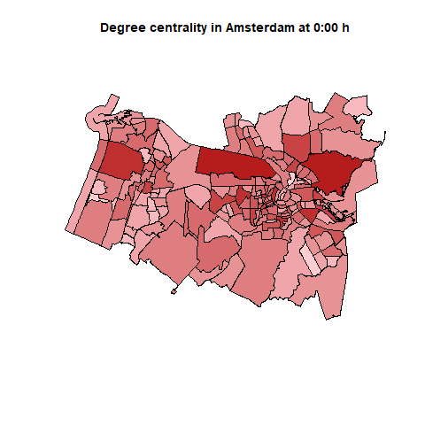{width=400px}

It can be seen in the figure that the most important areas are big ones, as expected. The darker colors are present in huge areas close to small ones. That means, large areas close to the city center. This makes sence, because if a large area is surrounded by small ones, then the number of neighbors can be higher. Also, there are some small areas in the city center with a dark color, meaning that the number of neighbors is high, and therefore its importance is high.

Using this centrality, we get a low number of important areas located in or near the city center, which makes sense. Also, there is another important area in the outskirts of the city. However, except for these few cases, the rest of the areas in the graph have a similar color, meaning a similar importance.  

To sum up, this centrality does not seem to be a good aproach, because it does not take into account the Uber trips. However, the results are quite logical, being most of the important areas located in the city center.

### Strength degree centrality
This one is a similar measure to the previous one. However, there is a very important difference: now, the importance of a node is determined not by its number of edges, but with the weighted sum of its edges. Recall that the weight of an edge between two nodes is the number of Uber cars which drove for a given time between both nodes, assuming that the route is the shortest path between origin and destination.

This centrality seems to be a very good one for this scenario. As said in the introduction of this document, the annalisys is performed in order to find out congested (or not congested) areas. Since the importance of a node is directly proportional to the number of cars which traspass that zone, then this one seems to be a good approach.

Recall that we are working with a dynamic graph. Hence, the number of trips between zones vary with time, obtaining a different value of the strength degree centrality for every hour. This evolution can be better seen in the attached GIF. 

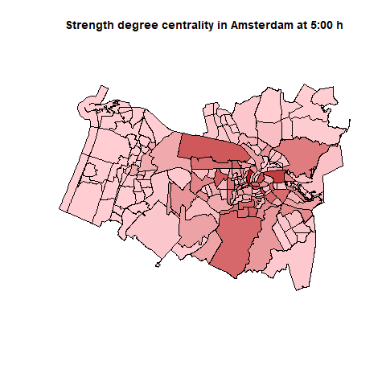{width=300px} 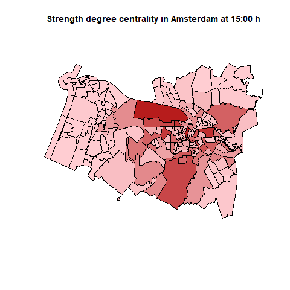{width=300px}

Two images corresponding to different times are provided. First, the traffic flow at 5:00h. Second, the traffic flow at 15:00h. In both cases the most important areas are the same ones. Those are big areas close to the city center, and many small areas in the city center. That means that those are the areas traspassed by most cars. 

The areas in the outskirts of the city are barely used by cars, while the closer to the city center an area is, the more cars drive there. There is an important fact that may explain why the small areas in the city center are less congested that the ones surrounding. Amsterdam is a beautiful city full of canals in the city center. There are small roads in both sides of the canals, but those are both full of people and bicicles. Hence, it makes sense for people to finish or begin their Uber trips in streets close to the city center (where most of the activity is concentrated), but close enough not to be far from where they are. In other words, it makes sense that there are many areas in the city senter where the traffic is not dense.

Now, let's compare both times in the figure. As said before, the most important areas are the same ones in both cases. However, at 5:00h there are much less traffic than at 15:00h, which is predictible; most of the activity in a city take place during the day. However, there is still traffic at 5:00h, when it seems reasonable to assume that some people start their work.

In the GIF attached to this document, it is possible to observe that the peak of traffic flow is obtained during the day, but there is still a lot of traffic until 2 or 3 am. The lowest amount of cars is obtained at 5:00h. From that point on, it starts to increase again.

Note that the assumption made in the degree centrality is shown to be correct: big areas, which have many neighbors, tend to be traspassed by many cars.


### Closeness centrality
The importance of a node (in a weighted graph) in the closeness centrality is inversely proportional to the sum of the weights of the shortest paths between that node and all the others. In other words, the most central node is the one from which it is possible to reach all the others avoiding as much traffic as possible. So, the higher the measure is, the better that node is for travelling to other nodes avoiding traffic jams.


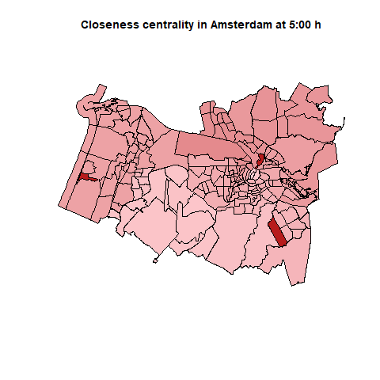{width=300px} 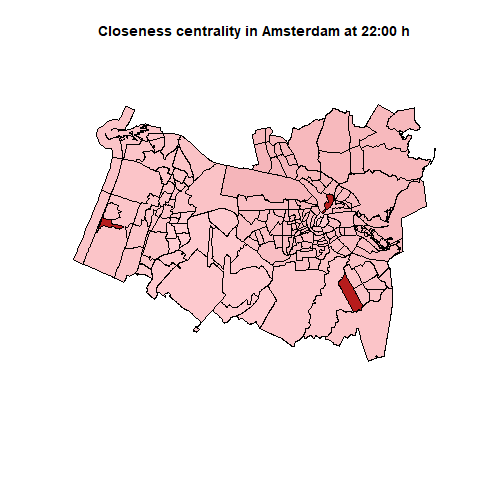{width=300px}


There are three nodes which remain very important all the time, by this metric. Those are small areas outside the city center. The rest of the nodes remain low in this metric, meaning that it is more likely to follow a congested route from those nodes. While the magnitude (or color, in the figures) remain more or less static, there is a slightly difference between day and night. For example, at 5:00h all the nodes seem to increase this metric. As seen in the strength degree centrality, at that time the traffic is very low, so it is more likely to avoid traffic jams from any node. However, during the day the traffic generaly increases, and the closeness centrality of the nodes decrease. This is an expected result.


### Betweenness centrality
In a weighted graph like this one, the betweenness centrality of a node measures how many paths between a pair of other nodes uses traverse particular node, where that path is the one which minimizes the sum of weights of the route. In other words, if a node is rated high by this centrality, it means that there are many traffic-free routes which traverse that node. Hence, that node is important for drivers if they want to avoid traffic.

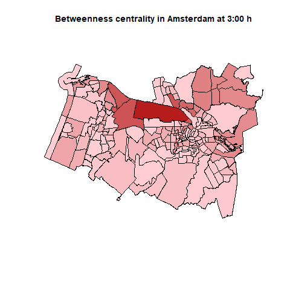{width=300px} 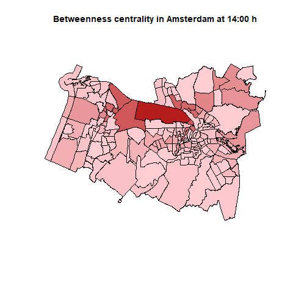{width=300px}

Again, there are differences between day and night times, even though those are slightly ones. As said before, there is less traffic during the night, so there will be more important nodes by this metric at night. On the contrary, there are less important nodes during the day, because the traffic is higher and so the sum weight of the path also increases. Overall, there is a most important node, which is always the same for all times. That one is a big area close to the city center.

To sum up, high rated nodes by betweenness centrality are important nodes for those drivers who want to avoid traffic, and one node highlights over the others.

### Eigen centrality

### Page Rank centrality


## Communities detection (S)

The analysis of community detection in the graph allows us to know which areas of the city show similar behavior at certain times of the day. The zones that are within the same community tend to connect with a greater probability than with zones of other communities, what, in our case, indicates which zones have similar traffic flow in a certain interval of time.

There are multiple community detection algorithms. We will only focus this analysis on the following ones: Edge-Betweenness, Fast-Greedy, Label Propagation and Walktrap. All of these algorithms take into account the weights of the edges, so they are good approaches for this case. It is worth mentioning that Spinglass and Optimal Modularity algorithms were also used during the tests. However, they were discarded: the first, because it does not work with unconnected networks, and the second, because it used too much computation time for a single graph, so using it in each of the 24 graphs would not entail finishing the analysis in a reasonable time.

### Edge-Betweenness

This algorithm uses the weight of the edges of the graph to detect communities. It is based on the idea that two nodes connected by an edge with a relatively high weight means that this edge is more likely to connect two different communities than one with a low weight. The algorithm iteratively eliminates those edges that have a high weight until some criterion is reached, thus obtaining communities of nodes separated from each other.

The results obtained with this algorithm for each graph are represented in the attached file _betweenness.com.gif_. As an example, the following figure shows the different communities detected in Amsterdam at 9am. It should be mentioned that, in these images, two colors that may seem the same at first glance represent different communities. In this case the algorithm finds 15 (VER ESTO PARA PONERLO CON CODIGO!!!!!!!!!!!!) different communities in the range of 9am to 10am. 

Observing the evolution of the communities detected throughout the day, it can be seen that the communities that vary the most are those farthest from the center, in the east and west, although they are not very substantial variations. This may happen because these zones are more likely to suffer big variations in traffic flow during the day. On the other hand, the communities that vary least in size correspond to central and more busy areas, with a more constant traffic flow than the outskirts.


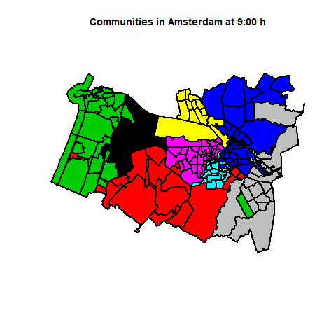{width=400px}

### Fast-Greedy

Fast-Greedy is an iterative algorithm that is based on optimizing the value of a quality function called modularity. The algorithm begins considering each node as an independent community. Subsequently, the communities are merged in such a way that this fusion is locally optimal, i.e. that the merge causes the greatest increase of all in the modularity. It is completed once this value can not be increased further.

The results over all the graphs can be observed in figure _fast.greedy.com.gif_. With this algorithm it can be observed that fewer (larger) communities are detected than with the previous algorithm. At the same time, the results obtained in terms of variation are similar to the ones from the previous algorithm: the sizes of the most central communities practically do not vary throughout the day, while the areas further east and west vary a little more.


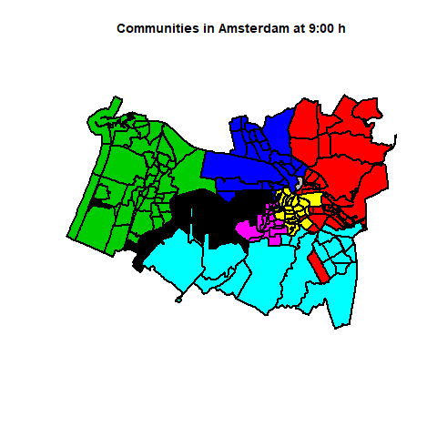{width=400px}

### Label Propagation

This is a very fast and simple algorithm. Label propagation is based on assigning one label out of $k$ in the initial configuration. Then, iteratively each node takes the most frequent label of all its neighbours in a synchronous way until each node has one of the most frequent labels in its neighbourhood.

The results obtained from this algorithm can be seen in figure _label.prop.com.gif_. The evolution in time of the communities vary much more than with the previous algorithms. During rush hours, the city center constains multiple small communities and the zones around it also vary in size. During the rest of the time, mainly at night, there are fewer communities and the variation is not very accused. Given that the central areas are the busiest, it is possible that the differences in traffic (weights) between edges of the city center are greater at peak hours, so, for each zone near the city center, the direct contact with zones out of the center with very low traffic and multiple zones inside the center with different traffic peaks can cause the formation of multiple communities in this part of the city.

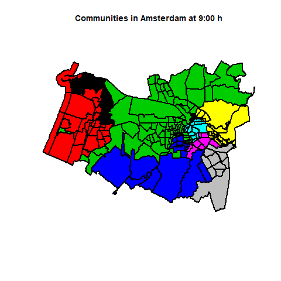{width=400px}

### Walktrap

This is the last algorithm used for detecting communities. The idea of Walktrap is that performing random walks on the graph lead to stay within the same community, since walking to other community is more unlikely due to the lower number of paths that exist among communities. This idea can be extended to weighted edges, assuming that it is more likely to walk through the edges with higher weights.

This algorithm obtains the largest number of communities of all the algorithms analyzed. The larger communities are close to the center, while in the eastern and western areas there are more and smaller communities. This can happen because near the city center the probability of following a path that leads to the zone with more traffic flow is higher than going other way, so the random walks cover a longer area when performed near the center.


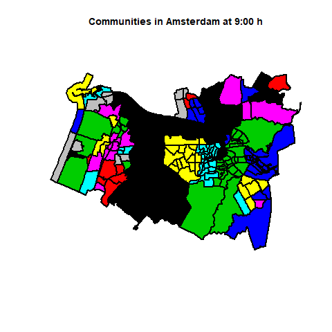{width=400px}


# Conclusion and future work (R/S)
IR AÑADIENDO SEGUN SURJA

Problemas: 
  -El punto de partida no es por coordenadas, sino por ID de zona. Para zonas grandes, si se quiere usar Maps, esto es un problema.
  -Las zonas grandes son más propensas a ser elegidas como ruta más corta, a pesar de que geográficamente son grandes (en el grafo solo es un nodo)
  -Pros de SP por nodos: simple, rápido (si pocos nodos)
  -Cons de SP por nodos: Esta ruta no se tiene por que corresponder con la real. 
  
Mejoras:
  -Cómo mejorar (usar Maps o similares), calcular optimal (que tarda mucho).
Tratar 


\newpage
# Anexo
```{r, eval=FALSE}
library(rgeos)
library(igraph)
library(rgdal)
library(rgl)
library(sp)
library(ggplot2)
library(knitr)

setwd("C:\\Users\\Usuario\\TELECO\\Master Tec Teleco\\2º CURSO\\Redes Sociales y Economicas\\Project\\GitHub\\RSE")
amsterdam <- read.csv("data\\amsterdam-wijk-2018-1-OnlyWeekdays-HourlyAggregate.csv", header = TRUE, sep = ",")
polys <- readOGR("data\\amsterdam_wijk.json")

adj_matrix <- gTouches(polys, byid = TRUE)

plot(polys, main = "Zones in Amsterdam", col="#f44336",border="black", lwd=2)

#Template graph: undirected and weighted (value 1 by default). Some centralities may fail for weight=0
g_original <- graph_from_adjacency_matrix(adj_matrix, weighted=TRUE, mode="undirected") %>% set_edge_attr("weight", value = 1)

#Calculate all shortest paths
sp <- list()
for (i in 1:nrow(adj_matrix)){
  sp[[length(sp) + 1]] <- get.shortest.paths(g_original, i)
}

#g is a list of graphs, one per hour of day
g <- list()

#Centralities:
degree.cent <- list()
degree.str.cent <- list()
closeness.cent <- list()
betweenness.cent <- list()
eigen.cent <- list()
page.rank.cent <- list()

#Communities
betweenness.com <- list()
fast.greedy.com <- list()
label.prop.com <- list()
spinglass.com <- list()
walktrap.com <- list()
optimal.com <- list()

#Index i=TRUE means that graph i is weakly connected
is_connected <- list() 

for (hour in 1:24){
  current_data <- subset(amsterdam, hod==hour-1)
  g[[length(g) + 1]] <- g_original
  
  for(i in 1:nrow(current_data)) {
    trip <- current_data[i,]
    #ID = position in matrix
    from <- trip$sourceid
    to <- trip$dstid
    
    #Se convierte el camino A B C en vector A B B C
    route <- as.vector(sp[[from]]$vpath[[to]])
    EP = rep(route, each=2)[-1]
    EP = EP[-length(EP)]
    
    #Coger ID de arista AB y BC (para acceder a E(g[[hour]]))
    edge_ids <- get.edge.ids(g[[hour]], EP)
    
    #Incrementar weight de arista AB y BC
    E(g[[hour]])$weight[edge_ids] = E(g[[hour]])$weight[edge_ids] + 1
    
  }
  
  is_connected[[length(is_connected) +1]] <- is.connected(g[[hour]], mode="weak")
  
  ##CENTRALITIES
  #Grado de un nodo (sin peso)
  degree.cent[[length(degree.cent) + 1]] <- centr_degree(g[[hour]], mode = "all")
  
  #Strength = suma de pesos de aristas por nodo
  degree.str.cent[[length(degree.str.cent) + 1]] <- strength(g[[hour]], mode = "all")
  
  #Numero de caminos con menos tráfico que pasan por un nodo (suma de pesos minimizada)
  betweenness.cent[[length(betweenness.cent) + 1]] <- betweenness(g[[hour]], directed = FALSE)
  
  #Parecido a pagerank. Una zona está congestionada si lo está, o si sus adyacentes también. Cuanto mayor, mejor.
  eigen.cent[[length(eigen.cent) + 1]] <- eigen_centrality(g[[hour]], directed = FALSE)
  
  #This is a disconnected graph, so closeness may not be usefull
  closeness.cent[[length(closeness.cent) + 1]] <- closeness(g[[hour]], mode = "all")
  
  #PageRank
  page.rank.cent[[length(page.rank.cent)+1]] <- page_rank(g[[hour]])
  
  
  
  ##COMUNITIES
  betweenness.com[[length(betweenness.com) + 1]] <- cluster_edge_betweenness(g[[hour]])
  fast.greedy.com[[length(fast.greedy.com) + 1]] <- cluster_fast_greedy(g[[hour]])
  label.prop.com[[length(label.prop.com) + 1]] <- cluster_label_prop(g[[hour]])
  walktrap.com[[length(walktrap.com) + 1]] <- cluster_walktrap(g[[hour]])
  
}
#Number of connected graphs
sum(as.integer(is_connected))
#Show centralities
rbPal <- colorRampPalette(c('#ffcdd2','#b71c1c'))

#Strength
png(filename="img\\degree.str.cent\\%02d.png")
for (hour in 1:24){
  Colores <- rbPal(100)[as.numeric(cut(degree.str.cent[[hour]],breaks = 100))]
  plot(polys, main = paste("Strength degree centrality in Amsterdam at ", (hour-1), ":00 h", sep=""), col=Colores,border="black", lwd=1)
}
dev.off()
system("\"C:\\Program Files\\ImageMagick-7.0.8-Q16\\magick.exe\" -delay 80 img\\degree.str.cent\\*.png img\\degree.str.cent\\degree.str.cent.gif")
#file.remove(list.files(pattern=".png"))

  
#Degree
png(filename="img\\degree.cent\\%02d.png")
for (hour in 1:24){
  Colores <- rbPal(100)[as.numeric(cut(degree.cent[[hour]]$res,breaks = 100))]
  plot(polys, main = paste("Degree centrality in Amsterdam at ", (hour-1), ":00 h", sep=""), col=Colores,border="black", lwd=1)
}
dev.off()
system("\"C:\\Program Files\\ImageMagick-7.0.8-Q16\\magick.exe\" -delay 80 img\\degree.cent\\*.png img\\degree.cent\\degree.cent.gif")
#file.remove(list.files(pattern=".png"))

  
#Closeness
png(filename="img\\closeness.cent\\%02d.png")
for (hour in 1:24){
  Colores <- rbPal(100)[as.numeric(cut(closeness.cent[[hour]],breaks = 100))]
  plot(polys, main = paste("Closeness centrality in Amsterdam at ", (hour-1), ":00 h", sep=""), col=Colores,border="black", lwd=1)
}
dev.off()
system("\"C:\\Program Files\\ImageMagick-7.0.8-Q16\\magick.exe\" -delay 80 img\\closeness.cent\\*.png img\\closeness.cent\\closeness.cent.gif")
#file.remove(list.files(pattern=".png"))

  
#Betweenness
png(filename="img\\betweenness.cent\\%02d.png")
for (hour in 1:24){
  Colores <- rbPal(100)[as.numeric(cut(betweenness.cent[[hour]],breaks = 100))]
  plot(polys, main = paste("Betweenness centrality in Amsterdam at ", (hour-1), ":00 h", sep=""), col=Colores,border="black", lwd=1)
}
dev.off()
system("\"C:\\Program Files\\ImageMagick-7.0.8-Q16\\magick.exe\" -delay 80 img\\betweenness.cent\\*.png img\\betweenness.cent\\betweenness.cent.gif")
#file.remove(list.files(pattern=".png"))


#Eigen
png(filename="img\\eigen.cent\\%02d.png")
for (hour in 1:24){
  Colores <- rbPal(100)[as.numeric(cut(eigen.cent[[hour]]$vector,breaks = 100))]
  plot(polys, main = paste("Eigen centrality in Amsterdam at ", (hour-1), ":00 h", sep=""), col=Colores,border="black", lwd=1)
}
dev.off()
system("\"C:\\Program Files\\ImageMagick-7.0.8-Q16\\magick.exe\" -delay 80 img\\eigen.cent\\*.png img\\eigen.cent\\eigen.cent.gif")
#file.remove(list.files(pattern=".png"))


#PageRank
png(filename="img\\page.rank.cent\\%02d.png")
for (hour in 1:24){
  Colores <- rbPal(100)[as.numeric(cut(page.rank.cent[[hour]]$vector,breaks = 100))]
  plot(polys, main = paste("PageRank centrality in Amsterdam at ", (hour-1), ":00 h", sep=""), col=Colores,border="black", lwd=1)
}
dev.off()
system("\"C:\\Program Files\\ImageMagick-7.0.8-Q16\\magick.exe\" -delay 80 img\\page.rank.cent\\*.png img\\page.rank.cent\\page.rank.cent.gif")
#file.remove(list.files(pattern=".png"))

png(filename="img\\betweenness.com\\%02d.png")
for (hour in 1:24){
  plot(polys, main = paste("Communities in Amsterdam at ", (hour-1), ":00 h", sep=""), col=membership(betweenness.com[[hour]]),border="black", lwd=2)
}
dev.off()
system("\"C:\\Program Files\\ImageMagick-7.0.8-Q16\\magick.exe\" -delay 80 img\\betweenness.com\\*.png img\\betweenness.com\\betweenness.com.gif")


png(filename="img\\fast.greedy.com\\%02d.png")
for (hour in 1:24){
  plot(polys, main = paste("Communities in Amsterdam at ", (hour-1), ":00 h", sep=""), col=membership(fast.greedy.com[[hour]]),border="black", lwd=2)
}
dev.off()
system("\"C:\\Program Files\\ImageMagick-7.0.8-Q16\\magick.exe\" -delay 80 img\\fast.greedy.com\\*.png img\\fast.greedy.com\\fast.greedy.com.gif")


png(filename="img\\label.prop.com\\%02d.png")
for (hour in 1:24){
  plot(polys, main = paste("Communities in Amsterdam at ", (hour-1), ":00 h", sep=""), col=membership(label.prop.com[[hour]]),border="black", lwd=2)
}
dev.off()
system("\"C:\\Program Files\\ImageMagick-7.0.8-Q16\\magick.exe\" -delay 80 img\\label.prop.com\\*.png img\\label.prop.com\\label.prop.com.gif")


png(filename="img\\walktrap.com\\%02d.png")
for (hour in 1:24){
  plot(polys, main = paste("Communities in Amsterdam at ", (hour-1), ":00 h", sep=""), col=membership(walktrap.com[[hour]]),border="black", lwd=2)
}
dev.off()
system("\"C:\\Program Files\\ImageMagick-7.0.8-Q16\\magick.exe\" -delay 80 img\\walktrap.com\\*.png img\\walktrap.com\\walktrap.com.gif")

```